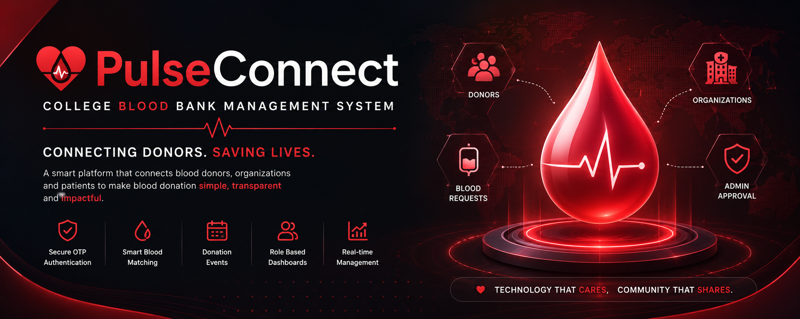
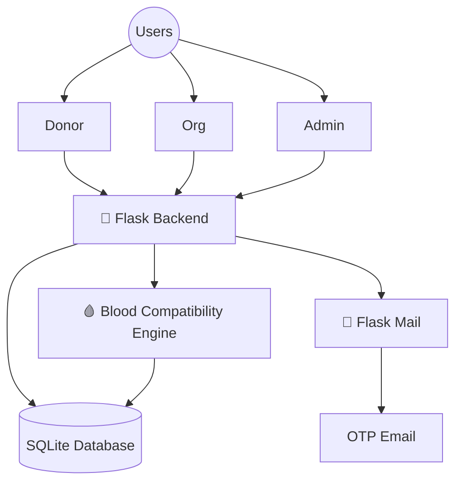

<!-- ======================== BANNER ======================== -->

  

<h1 align="center">
❤️ PulseConnect
</h1>

<h3 align="center">
Smart Blood Bank Management System
</h3>

---

# 🚀 About PulseConnect

PulseConnect is an intelligent Blood Bank Management System developed to simplify blood donation management inside colleges and organizations.

The platform securely connects **Donors**, **Organizations**, and **Administrators** while automating blood request management, OTP verification, donor matching, and blood donation events.

---

# 👥 Team Members

| Name | Role |
|------|------|
| Dhanush K P | Backend Development, Authentication & Database |
| Varshith V V | Frontend Development |
| Soorya Kiran Pola | UI/UX Design |
| Lulu Mol Kunnath | Testing & Documentation |

# ✨ Key Highlights

🩸 Smart Blood Group Matching

🔐 OTP Email Verification

👨‍⚕️ Donor Management

🏥 Organization Dashboard

🛡️ Admin Approval System

📢 Blood Donation Events

📧 Password Reset via OTP

⚡ Fast & Secure Flask Backend

---

# 🛠 Tech Stack

---

# 📊 Project Stats

---

# 🏗 System Architecture

---

# 🌟 Features

✅ Email OTP Verification

✅ Secure Authentication

✅ Blood Compatibility Search

✅ Blood Request Portal

✅ Event Management

✅ Admin Dashboard

✅ Password Reset

✅ Session Management

✅ Responsive UI

---

# 📸 Screenshots

---

# 💡 Future Scope

☁ Cloud Deployment

📱 Android App

🤖 AI Blood Demand Prediction

📍 Google Maps Integration

📊 Analytics Dashboard

🏥 Hospital API Integration

---

# 🤝 Project Credits

PulseConnect was developed as a collaborative academic project by a team of four Computer Science students.

Each member contributed to different aspects of the project, including backend development, frontend development, database design, UI/UX, testing, and documentation.

⭐ If you like this project, please consider giving it a Star ⭐

